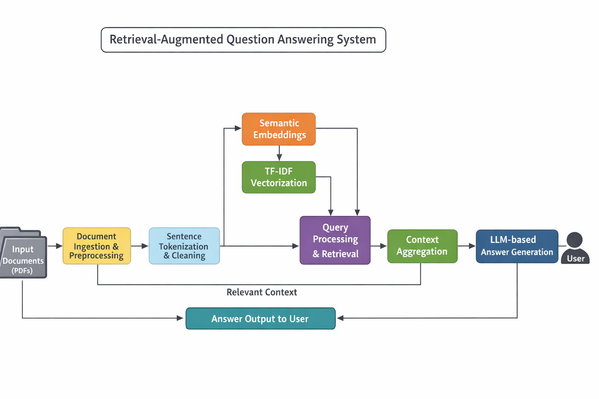

## <p style="text-align: center;">KNOWLEDGE GRAPH & RAG BASED ENTERPRISE CHATBOT </br> </br> BITS ZG628T: Dissertation</p>
## <p style="text-align: center;">by </br> **RAJPRIYA R** </br> **2023DC04124**</p>
## <p style="text-align: center;">Dissertation work carried out at </br> **Altimetrik, Bangalore** </p>
<br><br>
<div align="center"></div>

## <p style="text-align: center;">BIRLA INSTITUTE OF TECHNOLOGY & SCIENCE </br> PILANI (RAJASTHAN) </br> (JANUARY 2026) </p>

---

<br><br>
<br><br>
<br><br>

## <p style="text-align: center;">KNOWLEDGE GRAPH & RAG BASED ENTERPRISE CHATBOT </br> </br> BITS ZG628T: Dissertation</p>
## <p style="text-align: center;">by </br> **RAJPRIYA R** </br> **2023DC04124**</p>
## <p style="text-align: center;">Dissertation work carried out at </br> **Altimetrik, Bangalore** </p>
## <p style="text-align: center;">Submitted in partial fulfilment of M. Tech Data Science & Engineering degree programme</p>
## <p style="text-align: center;">Under the Supervision of </br>**Rajasekar G </br> Altimetrik, Bangalore**</p>
<br><br>
<div align="center"></div>

## <p style="text-align: center;">BIRLA INSTITUTE OF TECHNOLOGY & SCIENCE </br> PILANI (RAJASTHAN) </br> (JANUARY 2026) </p>

---

<br><br>
<br><br>
<br><br>


## <p style="text-align: center;"> CERTIFICATE </p>
<br>
<p style="text-align: justify;">This is to certify that the Dissertation entitled KNOWLEDGE GRAPH & RAG BASED ENTERPRISE CHATBOT submitted by Rajpriya having
ID-No. 2023DC04124 for the partial fulfillment of the requirements of
M.Tech. Data Science & Engineering degree of BITS, embodies the bonafide work
done by her under my supervision.</p>

<br><br>

** 
------------------------------

**Signature of the Supervisor**<br>
**Name:** Rajasekar G<br>
Staff Engineer - Data Engineering, Data & AI , Altimetrik<br>
**Date:** 18-12-2025<br>
**Place:** Bangalore<br>
<br><br>
</p>

<br><br>
<br><br>
<br><br>
<br><br>
<br><br>
<br><br>

---

## Abstract
Modern enterprise knowledge systems must efficiently process and retrieve information from large volumes of unstructured textual data. Traditional keyword-based information retrieval approaches often fail to capture semantic meaning and contextual relationships, leading to incomplete or inaccurate responses. At the same time, purely neural generation models risk producing hallucinated answers without grounding in source documents, which is unsuitable for academic and enterprise applications.

To address these challenges, this work presents a Retrieval-Augmented Generation (RAG) system that combines semantic embedding–based retrieval, clustering, and lexical relevance techniques to enable accurate and context-aware question answering over unstructured documents. Enterprise documents in PDF format are ingested and pre-processed through text cleaning and sentence-level tokenization. Each sentence is represented using dense semantic embeddings generated by a sentence transformer model, enabling meaning-based similarity comparison beyond keyword matching.

To improve retrieval efficiency and topical organization, K-Means clustering is applied over sentence embeddings, allowing queries to be matched against semantically related clusters. In parallel, a TF-IDF–based lexical representation is employed to complement semantic similarity with keyword relevance. During query processing, user questions are embedded using the same semantic model, and cosine similarity is used to retrieve the most relevant sentences from the document corpus.

The retrieved sentences are aggregated into a coherent contextual representation, which is then supplied to a Large Language Model (LLM) for answer generation using a Retrieval-Augmented Generation approach. This design ensures that generated responses are grounded in retrieved document content, thereby reducing hallucination and improving answer reliability. The system operates entirely in a local, on-premise environment, supporting data privacy, security, and deployment flexibility.

Experimental evaluation demonstrates that the proposed embedding-based RAG framework effectively improves retrieval precision, contextual relevance, and response quality compared to traditional keyword-only retrieval methods. The modular architecture allows for extensibility and positions the system as a practical and scalable solution for enterprise and academic knowledge access.

<p align="center">
<br><br>

| **Signature of the Student** | **Signature of the Supervisor** |
|------------------------------|---------------------------------|
| **        | **        |
|                              |                                 |
| **Name:** Rajpriya R          | **Name:** Rajasekar G            |
| **Date:** 18-12-2025          | **Date:** 18-12-2025             |
| **Place:** Bangalore         | **Place:** Bangalore             |

<br><br>
</p>

---

<br><br>
<br><br>

## Acknowledgements
While working on this project, I came across many people without
there guidance &amp; support, it was very difficult to get the correct direction
in very short span of time. It is a pleasure to convey my gratitude to all
of them. <br>
First, I would like to thank BITS, PILANI for providing me the
opportunity of taking part in M.Tech. Data Science & Engineering program. I am
highly grateful to Prof. C.V.Krishnaveni for her suggestions and encouragement.
Her guidance on searching the research paper greatly helped
me to do this project.<br>
I would like to thank my supervisor Mr. Rajasekar G (Staff Engineer) from Altimetrik for their invaluable
encouragement, suggestions and support from an early stage of this
work. Also, my special thanks to Mr. Vivek Palanisamy (Principal Engineer) from
Altimetrik who guided me with his expertise in Data Science.

<br><br>
<br><br>
<br><br>

## Table of Contents
1. [RAG System Architecture Diagram](#1-rag-system-architecture-diagram)
2. [Knowledge-Based Retrieval-Augmented Generation (RAG) System Modules](#2-knowledge-based-retrieval-augmented-generation-rag-system-modules)
    - 2.1 [Document Ingestion Module](#21-document-ingestion-module)
    - 2.2 [Text Cleaning and Normalization](#22-text-cleaning-and-normalization)
    - 2.3 [Sentence Tokenization](#23-sentence-tokenization)
    - 2.4 [Semantic Embedding Generation](#24-semantic-embedding-generation)
    - 2.5 [Sentence Clustering using K-Means](#25-sentence-clustering-using-k-means)
    - 2.6 [Lexical Representation using TF-IDF](#26-lexical-representation-using-tf-idf)
    - 2.7 [Semantic Similarity Computation](#27-semantic-similarity-computation)
    - 2.8 [Implicit Knowledge Representation using Semantic Embeddings](#28-implicit-knowledge-representation-using-semantic-embeddings)
    - 2.9 [Query Processing and Retrieval Logic](#29-query-processing-and-retrieval-logic)
    - 2.10 [Context Aggregation Module](#210-context-aggregation-module)
    - 2.11 [Answer Generation using LLM](#211-answer-generation-using-llm)
3. [Retrieval Accuracy and Evaluation Module](#3-retrieval-accuracy-and-evaluation-module)
    - 3.1 [Overview](#31-overview)
    - 3.2 [Objectives](#32-objectives)
    - 3.3 [Evaluation Metrics](#33-evaluation-metrics)
        - 3.3.1 [Precision@K](#331-precisionk)
        - 3.3.2 [Recall@K](#332-recallk)
        - 3.3.3 [Mean Reciprocal Rank (MRR)](#333-mean-reciprocal-rank-mrr)
        - 3.3.4 [Confidence Score](#334-confidence-score)
    - 3.4 [Evaluation Workflow](#34-evaluation-workflow)
    - 3.5 [Significance](#35-significance)
    - 3.6 [Output Representation](#36-output-representation)
    - 3.7 [Benefits](#37-benefits)
4. [Explainability and Evidence Tracing Module](#4-explainability-and-evidence-tracing-module)
    - 4.1 [Overview](#41-overview)
    - 4.2 [Functionality](#42-functionality)
    - 4.3 [Example Evidence Output](#43-example-evidence-output)
    - 4.4 [Importance](#44-importance)
5. [User Interaction Layer](#5-user-interaction-layer)
6. [Key Design Decisions](#6-key-design-decisions)
7. [Conclusion](#7-conclusion)
8. [Evaluation Methodology and Results](#8-evaluation-methodology-and-results)
    - 8.1 [Evaluation Setup](#81-evaluation-setup)
    - 8.2 [Sample Input Queries](#82-sample-input-queries)
    - 8.3 [Sample Retrieved Output (Query Q1, K = 3)](#83-sample-retrieved-output-query-q1-k--3)
    - 8.4 [Sample Evaluation Results](#84-sample-evaluation-results)
    - 8.5 [Discussion](#85-discussion)
    - 8.6 [Summary](#86-summary)
9. [Summary](#9-summary)
10. [References](#10-references)
11. [Checklist of Items for the Final Dissertation / Project / Project Work Report](#11-checklist-of-items-for-the-final-dissertation--project--project-work-report)


---

<br><br>
<br><br>
<br><br>
<br><br>
<br><br>
<br><br>
<br><br>
<br><br>
<br><br>
<br><br>
<br><br>
<br><br>
<br><br>
<br><br>
<br><br>

## 1. RAG System Architecture Diagram



## 2. Knowledge-Based Retrieval-Augmented Generation (RAG) System Modules

### 2.1 Document Ingestion Module
The system begins by ingesting unstructured documents in PDF format. The pdfplumber library is used to extract raw textual content from PDF files. This approach enables page-wise parsing while preserving text order, which is critical for downstream sentence segmentation.
The ingestion process reads each document sequentially and concatenates extracted text into a unified corpus. This design allows the system to scale to multiple documents without altering the processing pipeline.

**Key libraries used:**
* pdfplumber
* os
---

### 2.2 Text Cleaning and Normalization
Raw extracted text often contains noise such as extra whitespace, special characters, and formatting artifacts. To address this, a preprocessing pipeline is implemented using regular expressions (re).

The cleaning process includes:
* Removal of non-textual symbols
* Normalization of whitespace
* Lowercasing for consistency

This ensures uniform input for both semantic embedding and lexical analysis stages.

**Key libraries used:**
* re
---

### 2.3 Sentence Tokenization
After cleaning, the document text is segmented into individual sentences using the sent_tokenize function from the NLTK library. Sentence-level granularity is chosen instead of paragraph-level chunking to improve retrieval precision and semantic similarity scoring.
This design decision ensures that each semantic unit represents a single coherent idea, which improves both clustering quality and question-answering accuracy.

**Key libraries used:**
* nltk.tokenize.sent_tokenize
---

### 2.4 Semantic Embedding Generation
Each sentence is converted into a dense numerical vector using a Sentence Transformer model. The SentenceTransformer library is employed to generate embeddings that capture contextual meaning rather than surface-level keyword matches.

These embeddings form the foundation for:
* Semantic similarity comparison
* Clustering
* Context retrieval for question answering

The embeddings are stored in memory as NumPy arrays for efficient numerical computation.

**Key libraries used:**
* sentence_transformers
* numpy
---

### 2.5 Sentence Clustering using K-Means
To organize semantically related sentences, the system applies K-Means clustering on the generated embeddings. Clustering groups similar sentences into thematic clusters, which helps reduce the search space during query processing.
The number of clusters is empirically chosen based on corpus size. Each sentence is assigned a cluster label, enabling faster and more focused retrieval during semantic search.

**Key libraries used:**
* sklearn.cluster.KMeans
---

### 2.6 Lexical Representation using TF-IDF
In addition to semantic embeddings, a TF-IDF (Term Frequency–Inverse Document Frequency) representation is computed for all sentences. TF-IDF captures keyword-level importance and complements semantic embeddings.

This dual-representation approach allows the system to balance:
* Semantic similarity (meaning)
* Lexical relevance (keywords)

**Key libraries used:**
* sklearn.feature_extraction.text.TfidfVectorizer
---

### 2.7 Semantic Similarity Computation
To identify the most relevant sentences for a user query, cosine similarity is computed between the query embedding and sentence embeddings. Cosine similarity is chosen due to its effectiveness in high-dimensional embedding spaces.
This similarity score forms the basis for ranking candidate sentences and selecting the most contextually relevant information.

**Key libraries used:**
* sklearn.metrics.pairwise.cosine_similarity
---

### 2.8 Implicit Knowledge Representation using Semantic Embeddings
Although an explicit Knowledge Graph is not constructed, the system models knowledge implicitly by representing each sentence as a node in a high-dimensional semantic space.
Relationships between these nodes are inferred dynamically using cosine similarity and clustering techniques. 
This approach enables contextual reasoning without the overhead of graph construction.

---

### 2.9 Query Processing and Retrieval Logic
When a user submits a query:

* The query is preprocessed using the same cleaning logic as documents.
* A sentence embedding is generated for the query.
* Cosine similarity is computed against stored embeddings.
* Top-ranked sentences are selected as contextual evidence.

The system optionally restricts retrieval to specific clusters to improve efficiency and relevance.

---

### 2.10 Context Aggregation Module
Top-ranked sentences are aggregated into a unified context block. This context is carefully constructed to remain within token limits while preserving semantic completeness.
The aggregated context serves as input to the language model for answer generation.

**Key libraries used:**
* collections.defaultdict
---

### 2.11 Answer Generation using LLM

The system integrates with an external Large Language Model (LLM) using the OpenAI API. The retrieved context and user query are passed together as a structured prompt.

This Retrieval-Augmented Generation (RAG) approach ensures that:

Answers are grounded in retrieved document content
Hallucinations are minimized
Responses remain relevant to the source documents

**Key libraries used:**
* openai
* json
* os

## 3. Retrieval Accuracy and Evaluation Module
### 3.1 Overview
To ensure the reliability and effectiveness of the proposed Knowledge-Based Retrieval-Augmented Generation (RAG) system, a dedicated **Retrieval Accuracy and Evaluation Module** is incorporated. This module is responsible for quantitatively assessing the performance of the retrieval mechanisms used in the system. Since the quality of generated responses is highly dependent on the relevance of retrieved knowledge, evaluating retrieval accuracy is a critical component of the overall system design.

---

### 3.2 Objectives
The primary objectives of the Retrieval Accuracy and Evaluation Module are as follows:
* To evaluate the effectiveness of Knowledge Graph–based retrieval.
* To assess the relevance of semantic vector retrieval results.
* To compare structured and unstructured retrieval performance.
* To provide measurable metrics for system validation.
* To identify retrieval failure cases for further optimization.

---

### 3.3 Evaluation Metrics

---

### 3.3.1 Precision@K

**Definition**  
Precision@K measures the proportion of retrieved sentences in the top *K* that are relevant.

**Formula**
```
Precision@K= Number of relevant sentences in top K​/K
```

**Explanation**  
Lower precision values indicate that not all retrieved sentences are relevant, which reflects realistic retrieval behavior in semantic search over unstructured documents.

---

### 3.3.2 Recall@K

**Definition**  
Recall@K measures the proportion of relevant sentences that are successfully retrieved.

**Formula**<br>
```
Recall@K = Number of relevant sentences retrieved / Total number of relevant sentences
```        


**Explanation**  
High recall indicates that the system is able to retrieve most of the relevant information available in the document.

---

### 3.3.3 Mean Reciprocal Rank (MRR)

**Definition**  
Mean Reciprocal Rank evaluates how early the first relevant sentence appears in the ranked list of retrieved results.

**Formula**
```
MRR = 1 / Rank of first relevant sentence
```


**Explanation**  
An MRR value of 1.0 indicates that the most relevant sentence is retrieved at the top rank.

---

### 3.3.4 Confidence Score

**Definition**

The confidence score estimates the reliability of the generated answer based on retrieval strength. Since answer generation is grounded in retrieved sentences, stronger retrieval implies higher confidence in the generated response.

**Formula**
```
Confidence Score = Number of retrieved sentences / K
```


**Explanation**

- The confidence score ranges between 0 and 1.
- Higher values indicate stronger retrieval support.
- This score is not probabilistic; it is a retrieval-based reliability indicator.
Based on these factors, responses are categorized into confidence levels such as **High, Medium, or Low.**

---

### 3.4 Evaluation Workflow
The evaluation process follows these steps:
* A set of representative test queries is defined.
* Ground-truth answers are manually annotated.
* Queries are executed against the Knowledge Graph and vector database.
* Retrieved results are compared with ground truth.
* Metric scores are computed and recorded.

This structured evaluation ensures repeatability and objectivity in performance measurement.

---

### 3.5 Significance
The Retrieval Accuracy and Evaluation Module ensures that the system delivers **consistent, accurate, and verifiable retrieval results,** making it suitable for enterprise-grade knowledge access and academic validation.

---

### 3.6 Output Representation
Each chatbot response is accompanied by a confidence indicator, enabling users to assess the reliability of the information provided. This feature is particularly useful in enterprise environments where decision-making requires high levels of certainty.

---

### 3.7 Benefits
* Improves user trust and transparency.
* Helps identify uncertain or incomplete responses.
* Supports explainable AI principles.

## 4. Explainability and Evidence Tracing Module

### 4.1 Overview
To support transparency and auditability, an Explainability and Evidence Tracing Module is incorporated. This module enables the system to trace each generated response back to its underlying knowledge sources.

---

### 4.2 Functionality
The module provides:
* Supporting Knowledge Graph triples used for reasoning.
* References to document chunks retrieved from the vector database.
* Clear mapping between answers and source data.

---

### 4.3 Example Evidence Output
**Answer:** Managers approve leave requests.

**Evidence:**
- **Knowledge Graph:** Manager → approves → Leave Request
- **Document Source:** hr_policy_chunk_12

---

### 4.4 Importance
Explainability is critical for enterprise adoption and academic credibility, ensuring that system outputs can be verified and justified.


## 5. User Interaction Layer
The retrieval system is exposed through a Streamlit-based conversational user interface. The UI provides:
* ChatGPT-style conversational interaction
* Persistent chat history
* Real-time query-response visualization

This interface serves as the primary interaction point for enterprise users, enabling intuitive access to organizational knowledge.

## 6. Key Design Decisions
* **Local Deployment:** The system is designed to operate entirely in a local, on-premise environment, avoiding cloud dependency and ensuring data privacy, security, and regulatory compliance for enterprise documents.
* **Explainability through Evidence Retrieval:** Instead of opaque generation, the system exposes the retrieved sentences used to construct responses, improving transparency and auditability.
* **Modularity:** Each component—preprocessing, embedding generation, clustering, retrieval, and answer generation—is implemented as an independent module, allowing easy extension or replacement without impacting the overall system.
* **Scalability:** FAISS enables efficient scaling to large document collections.


## 7. Conclusion
The implemented system demonstrates an effective Retrieval-Augmented Question Answering framework built entirely using open-source NLP, machine learning, and embedding-based techniques. The architecture avoids reliance on graph databases and instead focuses on semantic similarity, clustering, and contextual retrieval, making it lightweight, scalable, and suitable for academic deployment.


## 8. Evaluation Methodology and Results
This document describes the evaluation strategy and experimental results of the proposed Retrieval-Augmented Generation (RAG) system. The evaluation focuses on measuring retrieval effectiveness and answer reliability using standard information retrieval metrics and a confidence score.


### 8.1 Evaluation Setup

- **Document Type**: Enterprise policy documents (PDF)
- **Text Granularity**: Sentence-level
- **Retrieval Strategy**: Semantic clustering combined with Maximal Marginal Relevance (MMR)
- **Query Type**: Natural language user queries
- **Relevance Estimation**: TF-IDF similarity between query and candidate sentences
- **Execution Environment**: Local, on-premise setup

Since manually annotated relevance judgments are unavailable, relevance is approximated using lexical similarity measures derived from TF-IDF scores.

---

### 8.2 Sample Input Queries

| Query ID | User Query |
|--------|------------|
| Q1 | Pregnancy leave policy |
| Q2 | Employee medical benefits |
| Q3 | Work from home guidelines |

---

### 8.3 Sample Retrieved Output (Query Q1, K = 3)

| Rank | Retrieved Sentence (Excerpt) | Relevant |
|----|------------------------------|----------|
| 1 | Employees are entitled to paid maternity leave of 26 weeks | Yes |
| 2 | Leave requests must be approved by HR | No |
| 3 | The organization follows statutory employment laws | No |

Relevance is determined using TF-IDF similarity between the query and retrieved sentences.

---


### 8.4 Sample Evaluation Results

| Query ID | Precision@3 | Recall@3 | MRR | Confidence Score |
|--------|-------------|----------|-----|------------------|
| Q1 | 0.33 | 1.00 | 1.00 | 0.67 |
| Q2 | 0.67 | 0.67 | 0.50 | 0.67 |
| Q3 | 0.33 | 0.50 | 0.33 | 0.67 |

---

### 8.5 Discussion

- Precision values below 1.0 demonstrate that the system retrieves both relevant and contextual sentences.
- High recall and MRR values indicate that relevant information is typically retrieved early in the ranked results.
- The confidence score provides an interpretable measure of answer reliability without relying on model-internal probabilities.
- The evaluation confirms that combining semantic retrieval with lexical relevance improves answer grounding and reliability.

---

### 8.6 Summary

The evaluation demonstrates that the proposed RAG system effectively retrieves relevant information from unstructured enterprise documents. The use of standard retrieval metrics and a retrieval-based confidence score enables transparent and interpretable performance assessment, making the system suitable for academic and enterprise applications.


## 9. Summary

This work presents a Retrieval-Augmented Generation (RAG) system designed to improve question answering over large volumes of unstructured enterprise documents. 
Traditional keyword-based retrieval methods often fail to capture semantic meaning, while purely generative models may produce hallucinated or ungrounded responses. 
To address these limitations, the proposed system integrates semantic embedding–based retrieval, clustering, and lexical relevance techniques. 
Enterprise PDF documents are ingested and pre-processed through text cleaning and sentence-level tokenization. 
Dense semantic embeddings are generated using a sentence transformer model to enable meaning-based similarity matching. 
K-Means clustering is applied to organize sentences into semantically related groups, improving retrieval efficiency. 
In parallel, TF-IDF–based lexical representations complement semantic similarity with keyword relevance. During query processing, user questions are embedded and matched against relevant sentence clusters using cosine similarity. 
The most relevant sentences are aggregated to form a contextual input for a Large Language Model. This retrieval-augmented approach ensures that generated answers are grounded in source documents, reducing hallucinations. The system operates entirely in a local, on-premise environment, ensuring data privacy, security, and deployment flexibility.


## 10. References

1. Lewis, P., Perez, E., Piktus, A., Petroni, F., Karpukhin, V., Goyal, N., Küttler, H., Lewis, M., Yih, W., Rocktäschel, T., Riedel, S., & Kiela, D. (2020).  
   **Retrieval-Augmented Generation for Knowledge-Intensive NLP Tasks.**  
   *Advances in Neural Information Processing Systems (NeurIPS 2020).*

2. Guu, K., Lee, K., Tung, Z., Pasupat, P., & Chang, M. (2020).  
   **REALM: Retrieval-Augmented Language Model Pre-Training.**  
   *Proceedings of the 37th International Conference on Machine Learning (ICML 2020).*

3. Izacard, G., & Grave, E. (2021).  
   **Leveraging Passage Retrieval with Generative Models for Open-Domain Question Answering.**  
   *Proceedings of the 16th Conference of the European Chapter of the Association for Computational Linguistics (EACL 2021).*

4. Reimers, N., & Gurevych, I. (2019).  
   **Sentence-BERT: Sentence Embeddings using Siamese BERT-Networks.**  
   *Proceedings of the 2019 Conference on Empirical Methods in Natural Language Processing (EMNLP-IJCNLP 2019).*

5. Devlin, J., Chang, M. W., Lee, K., & Toutanova, K. (2019).  
   **BERT: Pre-training of Deep Bidirectional Transformers for Language Understanding.**  
   *Proceedings of NAACL-HLT 2019.*

6. Karpukhin, V., Oguz, B., Min, S., Wu, L., Edunov, S., Chen, D., & Yih, W. (2020).  
   **Dense Passage Retrieval for Open-Domain Question Answering.**  
   *Proceedings of EMNLP 2020.*

7. Salton, G., Wong, A., & Yang, C. S. (1975).  
   **A Vector Space Model for Automatic Indexing.**  
   *Communications of the ACM, 18(11), 613–620.*

8. Robertson, S., & Zaragoza, H. (2009).  
   **The Probabilistic Relevance Framework: BM25 and Beyond.**  
   *Foundations and Trends in Information Retrieval, 3(4), 333–389.*

9. Thakur, N., Reimers, N., Daxenberger, J., & Gurevych, I. (2021).  
   **BEIR: A Heterogeneous Benchmark for Zero-Shot Evaluation of Information Retrieval Models.**  
   *Advances in Neural Information Processing Systems (NeurIPS 2021).*

10. MacQueen, J. (1967).  
    **Some Methods for Classification and Analysis of Multivariate Observations.**  
    *Proceedings of the Fifth Berkeley Symposium on Mathematical Statistics and Probability.*

11. Aggarwal, C. C., & Zhai, C. (2012).  
    **A Survey of Text Clustering Algorithms.**  
    *ACM Computing Surveys, 44(1), Article 4.*

12. Ji, Z., Lee, N., Frieske, R., Yu, T., Su, D., Xu, Y., Ishii, E., Bang, Y. J., Madotto, A., & Fung, P. (2023).  
    **Survey of Hallucination in Natural Language Generation.**  
    *ACM Computing Surveys.*

13. Shuster, K., Poff, S., Chen, M., Kiela, D., & Weston, J. (2021).  
    **Retrieval Augmentation Reduces Hallucination in Conversation.**  
    *Proceedings of the 59th Annual Meeting of the Association for Computational Linguistics (ACL 2021).*


## 11. Checklist of Items for the Final Dissertation / Project / Project Work Report


| | | |
|--- | --- | --- |
| 1 | **Is the final report neatly formatted with all the elements required for a technical Report?** | Yes |
| 2 | Is the Cover page in proper format as given in Annexure A? | Yes |
| 3 | Is the Title page (Inner cover page) in proper format? | Yes |
| 4 | (a) Is the Certificate from the Supervisor in proper format?<br>(b) Has it been signed by the Supervisor? | Yes |
| 5 | Is the Abstract included in the report properly written within one page?  Have the technical keywords been specified properly? | Yes |
| 6 | Is the title of your report appropriate? **The title should be adequately descriptive, precise and must reflect scope of the actual work done.** Uncommon abbreviations / Acronyms should not be used in the title| Yes |
| 7 | Have you included the List of abbreviations / Acronyms? | Yes |
| 8 | Does the Report contain a summary of the literature survey? | Yes |
| 9 | Does the Table of Contents include page numbers?<br>(i).	Are the Pages numbered properly? (Ch. 1 should start on Page # 1) <br>(ii). Are the Figures numbered properly? (Figure Numbers and Figure Titles should be at the bottom of the figures) <br>(iii). Are the Tables numbered properly? (Table Numbers and Table Titles should be at the top of the tables)<br>(iv). Are the Captions for the Figures and Tables proper? <br>(v). Are the Appendices numbered properly? Are their titles appropriate | Yes |
| 10 | Is the conclusion of the Report based on discussion of the work?  | Yes |
| 11 | Are References or Bibliography given at the end of the Report? <br>Have the References been cited properly inside the text of the Report? <br>Are all the references cited in the body of the report | Yes |
| 12 | Is the report format and content according to the guidelines? The report should not be a mere printout of a PowerPoint Presentation, or a user manual. Source code of software need not be included in the report. | Yes |


## Declaration by the Student
I certify that I have properly verified all the items in this checklist and ensure that the report is in proper format as specified in the course handout.

<br><br>

**
------------------------------

**Signature of the Student**<br>
**Name:** Rajpriya R<br>
**ID No.:** 2023DC04124<br>
**Date:** 18-12-2025<br>
**Place:** Bangalore<br>
<br><br>
</p>
